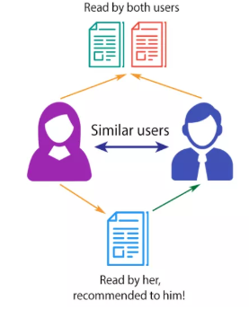
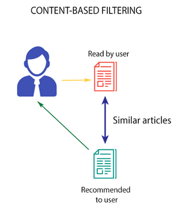

# A FOOD RECOMMENDER SYSTEM USING HYBRID FILTERING TECHNIQUES

Dataset
Two different datasets were made used of for the building of the food recommender system using hybrid filtering techniques. Visit link for more details https://www.kaggle.com/datasets/irkaal/foodcom-recipes-and-reviews?select=recipes.csv 

Recipes.csv
Recipes.csv dataset gotten from Kaggle which contains columns of food items and their nutritional contents like sugar content, protein content, carbohydrate content, calories etc. was used for the content-based filtering Nearest Neighbor model.
Reviews.csv
Reviews.csv dataset gotten from Kaggle which contains columns of the author’s name, their food ratings and reviews etc. was used for the collaborative filtering singular value decomposition (SVD) model. It also has a recipe id column which serves a foreign key that connects both datasets together.

CONTENT-BASED FILTERING (NEAREST NEIGHBORS)
A feature vector or profile for each item based on its content attributes like nutritional contents, ingredients and descriptions is created.
The Nearest Neighbors algorithm is used to calculate the similarity between the user input and the items based on their content attributes using the brute-force algorithm and cosine similarity metric.
For the user inputs, the most similar items based on their content similarities is identified. These similar items will serve as content-based recommendations.
cos(theta)=(A*B)/(||A||*||B||)

 
Figure 1: Content-based filtering architecture

COLLABORATIVE FILTERING (MATRIX FACTORIZATION)
The Matrix factorization is done using Singular Value Decomposition (SVD).
SVD is applied to factorize the user-item interaction matrix. The result is the user matrix (U), item matrix (V^T), and diagonal matrix of singular values (Σ). 
The number of latent factors (k) to keep is chosen and typically determined through cross-validation. The dimensionality of the factorized matrices is reduced and created U_k and V_k^T by selecting the top-k singular values and their corresponding columns from U and V^T.
The reduced U and V^T matrices are used to generate recommendations. This is done by computing the dot product or multiplication of the user vectors and item vectors.
For each user, predicted ratings for items is calculated using the SVD model. These predicted ratings represent the user's potential interest in each item.
The items are sorted based on their predicted ratings for each user. This will generate collaborative filtering recommendations for each user.

Figure 2: Collaborative filtering architecture

HYBRID MODEL INTEGRATION (WEIGHTED-FUSION)
The recommendations from both the content-based (NN) and the collaborative filtering (SVD) techniques are merged or combined.
To combine the recommendations from both filtering methods, a weighted fusion approach is employed. weights are assigned to the recommendations from the content-based filtering and collaborative filtering modules. 

[Alt text](<assets/Hybrid filtering.png>)
Figure 3: Hybrid recommendation approach flowchart for a food recommender system